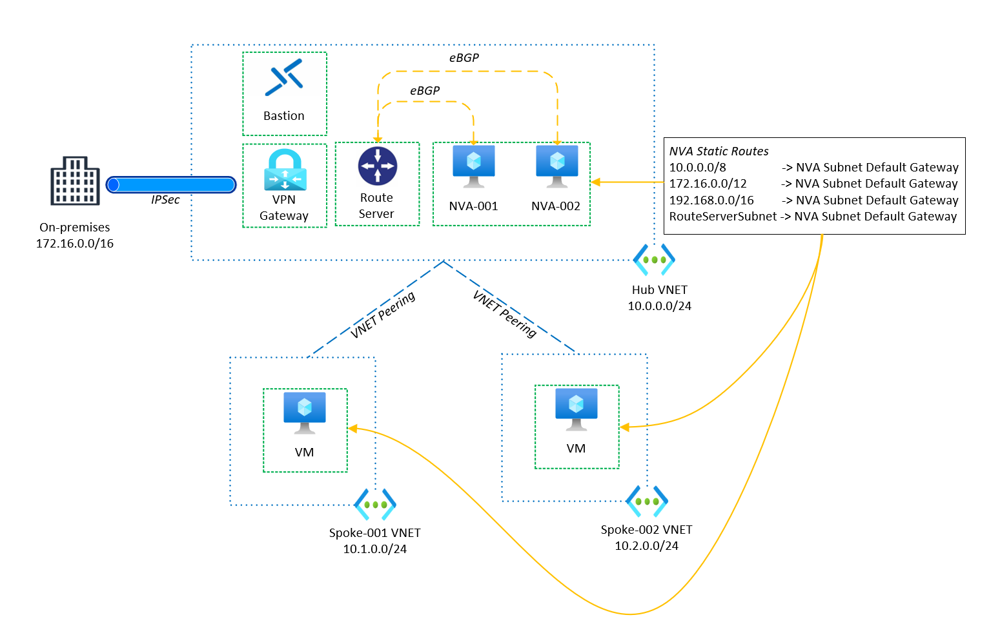
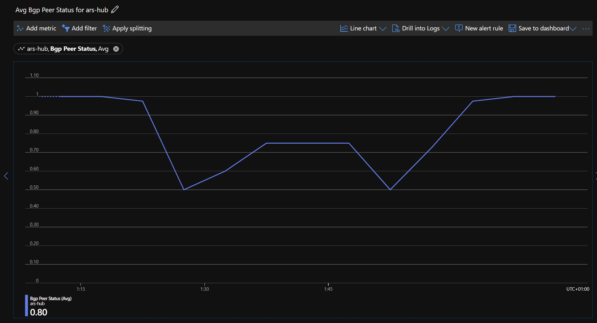
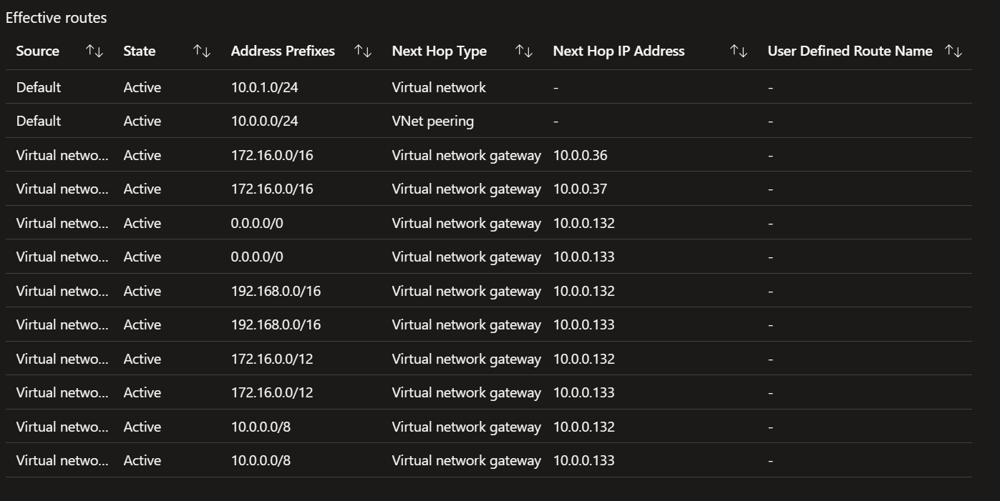

# Building High Availability with Azure Route Server using Terraform

In today's rapidly evolving cloud landscape, achieving high availability (HA) for network infrastructure is of utmost importance. Azure provides a robust platform to build and manage HA architectures. We'll explore how to set up high availability using Azure Route Server with Terraform. We'll dive into the key design decisions and walk through the Terraform code to better understand the implementation.

## Table of Contents

- [High Level Design](#high-level-design)
- [Key Design Decisions](#key-design-decisions)
  - [BGP Peering](#bgp-peering)
  - [NVA Static Routes](#nva-static-routes)
  - [Azure Bastion](#azure-bastion)
  - [Advertising Routes from the NVA to the Route Server](#advertising-routes-from-the-nva-to-the-route-server)
- [Deployment Steps](#deployment-steps)
  - [Prerequisites](#prerequisites)
  - [Deployment Steps](#deployment-steps-1)

## High Level Design



## Key Design Decisions

### BGP Peering

As is the magic of the Azure Route Server, the benefit of the BGP Peering between both NVAs and the Route Server is two-fold. First and foremost, we are reaping the benefits of the Route Server's ability to propagate the NVAs routes to other servers in the network. This negates any need for Route Tables in the Spokes' subnets, eliminating overhead. Secondly, through both peerings we have enabled high availability for the NVAs since upon failure of one NVA, the other NVA will continue to propagate its routes to the Route Server and beyond.

The configuration for the NVAs is pretty straightforward, its contained in a `.tftpl` file (for more information on template files in terraform see [here](https://developer.hashicorp.com/terraform/language/functions/templatefile)) and is applied to both NVAs. It's worth noting this additional line of configuration here:

```
route-map ars
 set as-path prepend ${nva_asn}
```

This is to ensure that NVA with the shorter ASN will be preferred for when both NVAs are up and running.

### NVA Static Routes

Here is a snippet of the static routes in the `config.nva.tftpl` file:

```
ip route 10.0.0.0 255.0.0.0 ${private_subnet_default_gateway}
ip route 172.16.0.0 255.240.0.0 ${private_subnet_default_gateway}
ip route 192.168.0.0 255.255.0.0 ${private_subnet_default_gateway}
ip route ${route_server_address} ${route_server_mask} ${private_subnet_default_gateway}
```

The first three routes are for the private address space, and the last route is for the Route Server's address space. The reason for this is that on some NVAs you need to explicitly define the next hop for the Route Server's address space in order to avoid **BGP Flapping**, which was the case for me in this lab. After the addition of the route, the BGP peering seemed much more stable. See [here](https://learn.microsoft.com/en-us/azure/route-server/troubleshoot-route-server#why-cant-i-tcp-ping-from-my-nva-to-the-bgp-peer-ip-of-the-azure-route-server-after-i-set-up-the-bgp-peering-between-them).

Here you can clearly see the impact of dropping and then reapplying that static route to RouteServerSubnet.



### Advertising Routes from the NVA to the Route Server

Here's a snippet of the routes being advertised on a server in the Spoke. As you can see, we directing traffic traffic destined for the RFC1918 address space to the NVAs as required.



### Azure Bastion

This design includes Azure Bastion, since as part of the NVA's configuration the default route `0.0.0.0/0` to the NVA's subnet's default gateway will be advertised also, meaning that we will lose the ability to connect to any server in the VNET via SSH or RDP. We could add route tables to the servers to route traffic destined for our public IP address to the internet, but we're trying to get rid of route tables in general, so we'll use Azure Bastion instead.

### Routes to the on-premises environment

As you may have alluded to from the diagram in [Advertising Routes from the NVA to the Route Server](#advertising-routes-from-the-nva-to-the-route-server), we have a couple of additional routes namely,

```
172.16.0.0/16 -> 10.0.0.37
172.16.0.0/16 -> 10.0.0.36
```

10.0.0.36 and 10.0.0.37 are the private ip addresses for the VPN Gateway, and the routes to the on-premises network have been propagated to the spokes. If we were to use a Route Table we would disable the route propagation option, then traffic destined for the on-premises environment would pass through the NVA, in our case it's bypassed directly.

Unfortunately as documented [here](https://learn.microsoft.com/en-us/azure/route-server/route-injection-in-spokes#:~:text=Azure%20Route%20Server%20doesn%27t%20advertise%20a%20route%20that%20is%20the%20same%20or%20longer%20prefix%20than%20the%20virtual%20network%20address%20space%20learned%20from%20the%20NVA.) Azure Route Server doesn't advertise a route that is the same or longer prefix than the virtual network address space learned from the NVA. This means that we can't advertise a more specific route for the on-premises network on the NVA.

To counter this, we could create an overlay tunnel from the NVAs in Azure to the on-premises device, and then disable BGP on the VPN Gateway. Jose Moreno documents this well in his blog post [here.](https://blog.cloudtrooper.net/2021/03/29/using-route-server-to-firewall-onprem-traffic-with-an-nva/)

## Deployment Steps

This terraform deployment makes use of several public modules including:

- Azure/terraform-azurerm-vnet-gateway
- Azure/terraform-azurerm-lz-vending
- luke-taylor/terraform-azurerm-nva

Making use of the great modules available to us will save a lot of time and effort. The modules are all available on the Terraform Registry, and can be found [here](https://registry.terraform.io/).

---
**NOTE**
This deployment contains a licence agreement resource, specifically:

```hcl
resource "azurerm_marketplace_agreement" "csr" {
  publisher = "cisco"
  offer     = "cisco-csr-1000v"
  plan      = "16_12-byol"
}
```

---

### Prerequisites

1. Azure CLI
2. Terraform
3. Azure Subscription

### Deployment Steps

1. Clone the repository.

    ```bash
    git clone https://github.com/luke-taylor/terraform-ha-nva-azure-route-server.git
    ```

2. Change directory to the repository.

    ```bash
    cd terraform-ha-nva-azure-route-server
    ```

3. Login to Azure CLI.

    ```bash
    az login
    ```

4. Change the default variables in `variables.tf` and locals in `locals.tf` as per your requirements. Otherwise you can use the default values.
5. Terraform init and apply.

    ```bash
    terraform init 
    terraform apply -auto-approve
    ```
